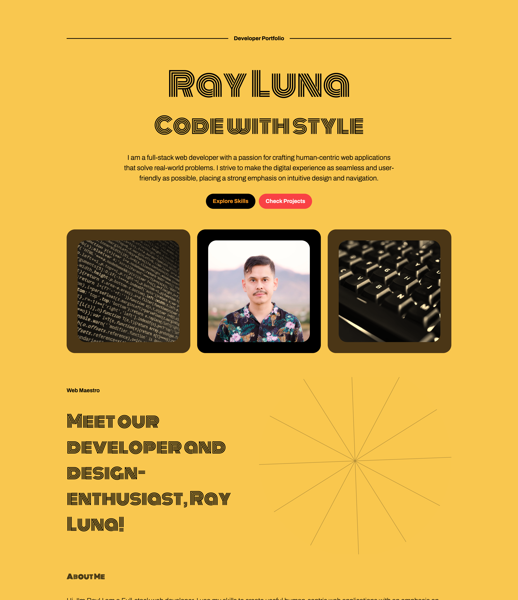

# Astro Portfolio

This is my current web developer portfolio and website [https://www.rayluna.dev/](https://www.rayluna.dev/).

This is a static site built using Astro as the meta-framework/static site generator and leverages Vue.js components for reactivity. It integrates with Sanity.io CMS to manage and display dynamic content that can be updated on the fly with Sanity Studio.

The site contains my bio that gives a glimpse into my professional background, skills, and projects. This list highlights the range of expertise I possess, including front-end development, back-end development, database management, and more.

### Project Links
- [https://www.rayluna.dev/](https://www.rayluna.dev/)
- [https://astro-portfolio-rldev.netlify.app/](https://astro-portfolio-rldev.netlify.app/)

### Related Project
- Dev CMS: [https://github.com/leon-luna-ray/dev-cms](https://github.com/leon-luna-ray/dev-cms)

## Technologies

- Astro
- JavaScript
- Netlify
- Sass
- Sanity.io
- Tailwind CSS
- Typescript
- Vue.js

## Image

